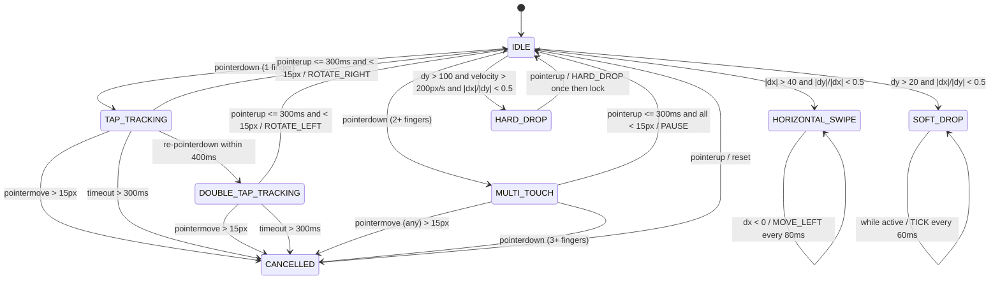

# Gesture Control Specification

## Overview

Gesture controls provide a natural, screen-based input method optimized for touch devices. This document specifies the complete gesture language, including thresholds, conflict resolution, and implementation details.

## Core Gesture Set

| Gesture | Action | Timing/Distance | Feedback |
| ------- | ------ | --------------- | -------- |
| **Tap** | Rotate clockwise | Max 300ms, ≤15px movement | Haptic: light pulse |
| **Double Tap** | Rotate counter-clockwise | Second tap within 400ms, ≤15px each | Haptic: light pulse |
| **Swipe Left** | Move left (repeat while sliding) | ≥40px horizontal, \|dy\| < \|dx\| | Haptic: micro-pulse per move |
| **Swipe Right** | Move right (repeat while sliding) | ≥40px horizontal, \|dy\| < \|dx\| | Haptic: micro-pulse per move |
| **Swipe Down (Soft)** | Soft drop (while finger active) | 20-100px down, <400ms | Haptic: none (continuous) |
| **Flick Down (Hard)** | Instant hard drop | >100px down, >200px/s velocity | Haptic: strong pulse |
| **Swipe Up** | Hold/swap piece | ≥50px up, \|dx\| < \|dy\| | Haptic: medium pulse |
| **Two-Finger Tap** | Pause/unpause | Both fingers down <300ms, ≤15px each | Haptic: distinctive double pulse |

## Threshold Reference Table

```text
THRESHOLDS (milliseconds and pixels):
├─ TAP_MAX_TIME: 300 ms
├─ TAP_MAX_DISTANCE: 15 px
├─ DOUBLE_TAP_MAX_TIME: 400 ms (between taps)
├─ SWIPE_MIN_DISTANCE: 40 px (horizontal)
├─ SOFT_DROP_MIN_DISTANCE: 20 px
├─ SOFT_DROP_MAX_DISTANCE: 100 px
├─ HARD_DROP_MIN_DISTANCE: 100 px
├─ HARD_DROP_MIN_VELOCITY: 200 px/s
├─ MOVE_MIN_DISTANCE: 50 px (vertical, for hold)
├─ MOVE_REPEAT_COOLDOWN: 80 ms
├─ ACTION_REPEAT_COOLDOWN: 60 ms
└─ TWO_FINGER_MAX_TIME: 300 ms
```

## Gesture Recognition State Machine



## Conflict Resolution Rules

When multiple gestures could match, apply rules in order:

1. **Hard drop wins over soft drop**: If velocity > 200px/s, treat as hard drop regardless of distance.
2. **Horizontal swipe wins over vertical**: If |dx| > |dy| × 1.5, treat as horizontal move.
3. **Hold gesture priority**: Upward swipe (>50px up) is only recognized if horizontal movement is minimal (<25px).
4. **Two-finger tap is atomic**: If pointers leave within 300ms with <15px movement each, pause wins over any one-finger interpretation.

## Input Buffering

Queue one pending action during animations to ensure responsive control at high speed:

- Gestures emit actions immediately.
- Store captures buffered action when current action completes.
- Max buffer depth: 1 action (older buffered actions are discarded).

## Cooldown and Repeat Behavior

- **Move Repeat Cooldown**: 80 ms between repeated MOVE_LEFT/MOVE_RIGHT emissions from a single swipe.
- **Action Repeat Cooldown**: 60 ms between repeated TICK (soft drop) emissions from continuous downward swipe.
- **Flick Detection**: Hard drop triggers once on flick velocity detection; subsequent downward movement at lower velocity does not re-trigger.

## Accessibility & Customization

### Sensitivity Levels

Players can adjust via settings panel:

- **Casual Mode**: TAP_MAX_DISTANCE = 20px, SWIPE_MIN_DISTANCE = 50px, HARD_DROP_MIN_VELOCITY = 250px/s
- **Standard Mode** (default): All thresholds as specified above.
- **Competitive Mode**: TAP_MAX_DISTANCE = 10px, SWIPE_MIN_DISTANCE = 30px, HARD_DROP_MIN_VELOCITY = 180px/s

### Fallback Controls

If gesture recognition feels unsuitable:

- On-screen buttons remain fully functional and enabled by default.
- Players can optionally hide button overlay via accessibility settings.
- Keyboard controls remain unchanged and always active.

## Visual & Haptic Feedback

### Visual Feedback

- **Gesture recognized**: 100–150 ms highlight/glow on piece or brief action label near piece.
- **Hard drop**: Flash animation on piece lock.
- **Hold swap**: Animate piece swap transition (100 ms fade).

### Haptic Feedback (configurable on/off)

| Action | Pattern | Intensity |
| ------ | ------- | --------- |
| Rotate | Single pulse | Light |
| Move | Micro-pulse per shift | Very light |
| Soft drop | None (continuous) | N/A |
| Hard drop | Strong pulse + secondary | Strong |
| Hold swap | Medium pulse | Medium |
| Pause | Double pulse (distinctive) | Medium |
| Line clear | 3× rapid pulses | Strong |

### Audio Feedback (configurable on/off)

| Action | Sound | Duration |
| ------ | ----- | -------- |
| Rotate | Click (200 Hz, 50 ms) | 50 ms |
| Move | Soft tick (300 Hz, 30 ms) | 30 ms |
| Hard drop | Drop sound (150 Hz descending, 100 ms) | 100 ms |
| Lock | Lock sound (400 Hz, 80 ms) | 80 ms |
| Pause | Pause chime (2-note, 200 ms) | 200 ms |
| Line clear | Ascending chime (300–600 Hz, 300 ms) | 300 ms |

## Implementation Notes

### Event Model

- Use `PointerEvent` API for unified mouse/touch/pen input.
- Distinguish single-finger vs. multi-touch via `pointerId` tracking.
- Compute velocity using distance traveled ÷ time elapsed.

### Gesture State

Track per pointer:

- Start position (x₀, y₀, t₀)
- Current position (x, y, t)
- Accumulated path (for velocity smoothing)
- Last action emission time (for cooldown)

### Gesture Classification

On pointer move:

1. Compute displacement (dx, dy).
2. Compute elapsed time.
3. Compute velocity (if moving).
4. Match against pattern thresholds in priority order.
5. Emit action if thresholds crossed and cooldown elapsed.

## Common Implementation Pitfalls to Avoid

1. **Tap threshold too loose**: Setting TAP_MAX_DISTANCE >20px causes accidental rotates during swipe intent.
2. **Hard drop too eager**: Triggering on any downward movement causes unwanted drops; always check velocity.
3. **No conflict detection**: Allowing tap and swipe to both emit causes jittery responses; use priority rules.
4. **Missing cooldowns**: Without move/action cooldowns, repeated emissions spam the dispatcher.
5. **No feedback**: Players cannot tell if gesture was recognized; always emit visual or haptic signal.
6. **Blocking two-finger**: If not properly isolated, two-finger pause gesture conflicts with one-finger tap re-detection.
7. **Ignoring velocity**: Velocity calculation must account for smoothing over at least 100 ms of history to avoid noise.

## Testing Strategy

- **Unit tests**: Validate gesture classification against threshold tables (40+ test cases).
- **Integration tests**: Verify state machine transitions and conflict resolution.
- **E2E tests**: Simulate real pointer sequences (tap, swipe, flick, multi-touch).
- **Performance tests**: Ensure pointer events stay <16ms per frame on 60 Hz displays.
