# Tetromino Stacking – Software Architecture

## Table of Contents

- [Tetromino Stacking – Software Architecture](#tetromino-stacking--software-architecture)
  - [Table of Contents](#table-of-contents)
  - [1. Purpose and Scope](#1-purpose-and-scope)
  - [2. Architectural Principles](#2-architectural-principles)
  - [3. Architecture Block Diagram](#3-architecture-block-diagram)
  - [4. Module Responsibilities](#4-module-responsibilities)
    - [4.1 Core Domain (`js/core/`)](#41-core-domain-jscore)
      - [`constants.js`](#constantsjs)
      - [`random.js`](#randomjs)
      - [`tetrominoes.js`](#tetrominoesjs)
      - [`engine.js`](#enginejs)
    - [4.2 Application Layer (`js/app/`)](#42-application-layer-jsapp)
      - [`store.js`](#storejs)
      - [`controller.js`](#controllerjs)
      - [`gesture-recognizer.js`](#gesture-recognizerjs)
      - [`worker.js`](#workerjs)
      - [`navigation.js`](#navigationjs)
    - [4.3 Presentation (`html5/src/`)](#43-presentation-html5src)
      - [`index.html`](#indexhtml)
      - [`css/index.css`](#cssindexcss)
  - [5. Dependency Diagram](#5-dependency-diagram)
  - [6. State Model](#6-state-model)
    - [Action Catalogue](#action-catalogue)
    - [Gesture Recognition](#gesture-recognition)
    - [Replay Snapshot Persistence](#replay-snapshot-persistence)
    - [Leaderboard Persistence](#leaderboard-persistence)
  - [6.5 Offline Support and PWA](#65-offline-support-and-pwa)
    - [Service Worker Architecture](#service-worker-architecture)
    - [Registration and Lifecycle](#registration-and-lifecycle)
    - [PWA Manifest](#pwa-manifest)
    - [Offline Behavior](#offline-behavior)
    - [Browser Support](#browser-support)
    - [Installation Instructions by Platform](#installation-instructions-by-platform)
      - [Android (Chrome, Firefox, Edge)](#android-chrome-firefox-edge)
      - [iOS (Safari 11.3+)](#ios-safari-113)
      - [Desktop (Chrome, Edge)](#desktop-chrome-edge)
      - [Mac/Linux](#maclinux)
    - [Implementation Notes](#implementation-notes)
  - [7. State Chart](#7-state-chart)
  - [8. Runtime Workflow Diagram](#8-runtime-workflow-diagram)
  - [9. Object Message Exchange](#9-object-message-exchange)
    - [9.1 Normal Tick (gravity)](#91-normal-tick-gravity)
    - [9.2 Piece lock and line clear](#92-piece-lock-and-line-clear)
    - [9.3 User keyboard input](#93-user-keyboard-input)
    - [9.4 Options – OK flow](#94-options--ok-flow)
    - [9.4b Touch swipe input](#94b-touch-swipe-input)
    - [9.5 Game Over and Restart](#95-game-over-and-restart)
  - [10. Navigation Flow Diagram](#10-navigation-flow-diagram)
  - [11. Test Architecture and Coverage Strategy](#11-test-architecture-and-coverage-strategy)
    - [11.1 Tooling](#111-tooling)
    - [11.2 Test Files](#112-test-files)
    - [11.3 Coverage Thresholds](#113-coverage-thresholds)
    - [11.4 Coverage Scope](#114-coverage-scope)
  - [12. File Structure](#12-file-structure)
  - [13. Migration Summary](#13-migration-summary)
  - [14. Future Extensions](#14-future-extensions)

---

## 1. Purpose and Scope

This document describes the software architecture of **Tetromino Stacking**, a browser-based
solitaire tile-stacking game. The architecture was designed around the following goals:

- **Zero runtime dependencies** – no jQuery, jQuery Mobile, Raphaël, or any UI framework.
- **Pure functional game core** – all game logic is expressed as pure functions and a
  deterministic reducer, making it trivially testable and reproducible.
- **Reactive rendering** – the UI is a projection of state; changes propagate through a
  lightweight reactive store.
- **Async game loop** – the ticker is an `async/await` loop driven by `AbortController`,
  making it easy to pause, resume, and cancel cleanly.
- **High-confidence testing** – 100 % statement, line, function and branch coverage enforced
  by a coverage gate in CI configuration.

---

## 2. Architectural Principles

| Principle | Description |
| --- | --- |
| **Functional Core, Imperative Shell** | All domain logic (collision, line clearing, scoring, queue) lives in stateless pure functions. Side effects (DOM, timers, events) are isolated in the app shell. |
| **Immutable State** | Every action produces a new state object; original state is never mutated. |
| **Deterministic Randomness** | The pseudo-random generator is seeded and returns both the value and the next seed, enabling replay of any game by replaying the seed. |
| **Single Responsibility** | Each module has one clear purpose. The store does not know about rendering; the engine does not know about DOM. |
| **Dependency Direction** | Dependencies flow inward: `app.js` → `app/*` → `core/*`. Nothing in `core/` depends on the browser. |

---

## 3. Architecture Block Diagram

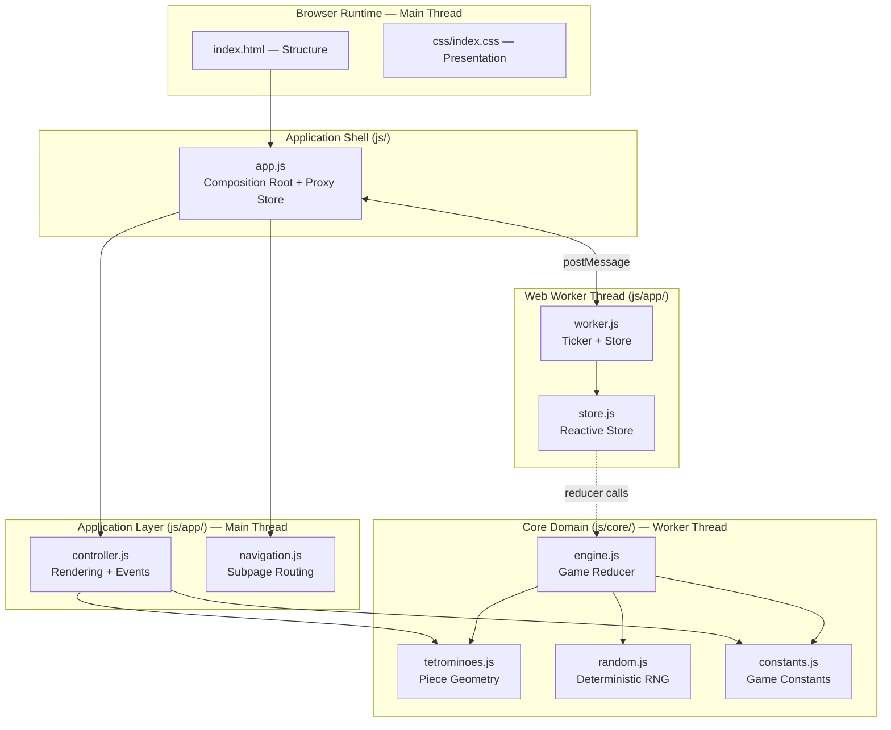

---

## 4. Module Responsibilities

### 4.1 Core Domain (`js/core/`)

#### `constants.js`

Exports pure compile-time constants shared across all layers:

- Board dimensions (`BOARD_COLS`, `BOARD_ROWS`, `BOARD_VISIBLE_ROWS`, `BOARD_HIDDEN_ROWS`)
- Tick interval (`INITIAL_TICK_MS`)
- Piece type identifiers (`PIECE_TYPES`)
- Per-piece colours (`PIECE_COLORS`)
- Empty cell sentinel (`CELL_EMPTY = null`)

#### `random.js`

Implements a 32-bit LCG (linear congruential generator):

```text
seed' = (1664525 × seed + 1013904223) mod 2³²
```

All functions return `{ seed, value }` – the caller threads the seed explicitly,
making every call reproducible.

| Export | Description |
| --- | --- |
| `nextSeed(seed)` | Advance the seed one step |
| `nextFloat(seed)` | Uniform float in `[0, 1)` |
| `nextInt(seed, max)` | Integer in `[0, max)` |
| `pickFromList(seed, list)` | Pick a uniformly random element |

#### `tetrominoes.js`

Defines all seven tetrominoes and four rotations each using relative cell
offsets. The `cellsForPiece(piece)` function converts a piece descriptor
`{ type, rotation, x, y }` into absolute board coordinates.

#### `engine.js`

The heart of the application. All exports are pure functions:

| Export | Description |
| --- | --- |
| `createBoard()` | Produce an empty board matrix |
| `collides(board, piece)` | Detect collisions (wall, floor, occupied cell) |
| `clearCompletedLines(board)` | Remove full rows, return new board + count |
| `createInitialState(seed)` | Build a full initial game state |
| `gameReducer(state, action)` | Transition function – returns next state |
| `projectBoardWithActivePiece(state)` | Overlay active piece on board for rendering |

### 4.2 Application Layer (`js/app/`)

#### `store.js`

Minimal reactive store:

```text
createStore(reducer, initialState) → { getState, dispatch, subscribe }
```

- `dispatch(action)` – runs the reducer; notifies subscribers only when state reference changes.
- `subscribe(listener)` – returns an unsubscribe function (no memory leak).

#### `controller.js`

DOM rendering helpers and event wiring:

| Export | Description |
| --- | --- |
| `createBoardView(node, rows, cols)` | Build and return a `paint(state, board)` renderer |
| `renderQueue(queueNode, state)` | Paint the piece-preview queue |
| `renderHUD(scoreNode, pauseBtn, state)` | Update score/status text |
| `createActionBinding(el, ev, factory, dispatch)` | Attach and return a removable event listener |
| `createKeyboardMap(dispatch)` | Map keyboard codes to game actions |

#### `gesture-recognizer.js`

Sophisticated multi-gesture recognition engine using a state machine and PointerEvent API:

| Export | Description |
| --- | --- |
| `GestureRecognizer` class | State machine that recognizes 8 gestures with threshold validation, conflict resolution, and cooldown management |
| `createGestureRecognizer(element, dispatch, config)` | Factory attaches recognizer to a DOM element and returns an unsubscribe function |

**Supported Gestures:**

| Gesture | Action | Threshold |
| --- | --- | --- |
| Tap | `ROTATE_RIGHT` | <15px movement, <300ms |
| Double Tap | `ROTATE_LEFT` | Second tap within 400ms, <15px each |
| Swipe Left | `MOVE_LEFT` (repeat 80ms) | >40px horizontal, <50% vertical |
| Swipe Right | `MOVE_RIGHT` (repeat 80ms) | >40px horizontal, <50% vertical |
| Swipe Down | `TICK` (repeat 60ms) | 20–100px down, <50% horizontal |
| Flick Down | `HARD_DROP` | >100px at >200px/s velocity |
| Swipe Up | `HOLD_PIECE` | >50px up, <50% horizontal |
| Two-Finger Tap | `TOGGLE_PAUSE` | <300ms, <15px per pointer |

**Key Features:**

- 8-state machine (IDLE, TAP_TRACKING, DOUBLE_TAP_TRACKING, HORIZONTAL_SWIPE, SOFT_DROP, HARD_DROP, MULTI_TOUCH, CANCELLED)
- Per-pointer state tracking for multi-touch scenarios
- Conflict resolution by priority (hard drop > horizontal > vertical)
- Cooldown system prevents input spam
- 3 sensitivity presets: casual, standard (default), competitive
- Optional haptic/audio feedback callbacks
- Full PointerEvent API support (mouse, touch, pen)

**Configuration:**

```javascript
const recognizer = createGestureRecognizer(boardElement, store.dispatch, {
  preset: 'standard',        // or 'casual' / 'competitive'
  onGesture: (action) => {}, // optional callback for custom handling
  onFeedback: (type, intensity) => {} // optional haptic/audio integration
});
```

See [doc/gesture_controls_spec.md](gesture_controls_spec.md) for complete specification.

#### `worker.js`

Web Worker entry point. Runs entirely off the main thread:

- Creates the store and initial state (seeded with `Date.now()`).
- Runs the async gravity ticker loop (`TICK` every `tickMs` milliseconds).
- Posts `{ type: "STATE", state, action }` to the main thread on every state change and `{ type: "STATE", state }` once on startup.
- Handles incoming `{ type: "ACTION", action }` messages from the main thread by calling `store.dispatch`.

#### `navigation.js`

Subpage routing without a router library:

| Export | Description |
| --- | --- |
| `bindNavigationAndSubpages(nodes, store)` | Wire all menu, subpage open/close, and options OK/Cancel flows |
| `readOptionsDraft(nodes)` | Read current form values into a settings object |
| `applyStateToOptionsForm(nodes, state)` | Sync form controls to state |

### 4.3 Presentation (`html5/src/`)

#### `index.html`

Semantic, ARIA-annotated markup organised into:

- `<header>` – menu toggle, title, HUD score label
- `<main>` – board grid, piece queue, touch control pad, keyboard hints
- `<nav id="main-nav">` – slide-over navigation menu
- `<section id="options-page">` – Options modal (delay, colour mode, main colour)
- `<section id="rules-page">` – Rules modal
- `<section id="about-page">` – About / legal modal

#### `css/index.css`

Custom-property-driven dark theme. No CSS framework dependency.

Key design tokens:

| Token | Role |
| --- | --- |
| `--bg` | Page background |
| `--surface` | Card / panel background |
| `--board-bg` / `--cell-empty` | Board interior colours |
| `--accent` | Interactive highlight colour |
| `--cell-size` | Responsive board cell dimension |

---

## 5. Dependency Diagram

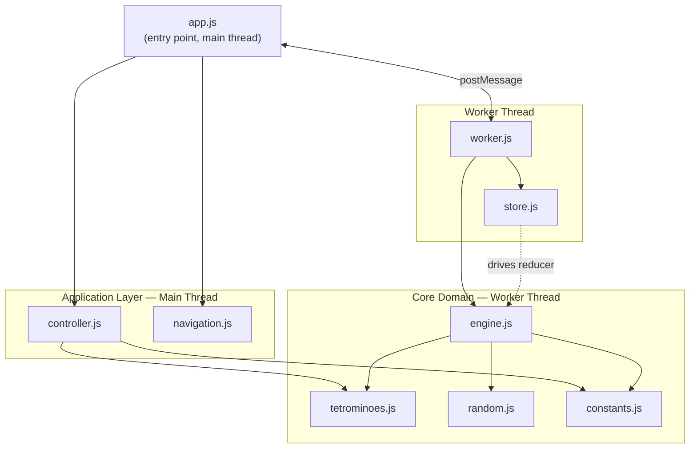

---

## 6. State Model

The complete game state is a plain JavaScript object:

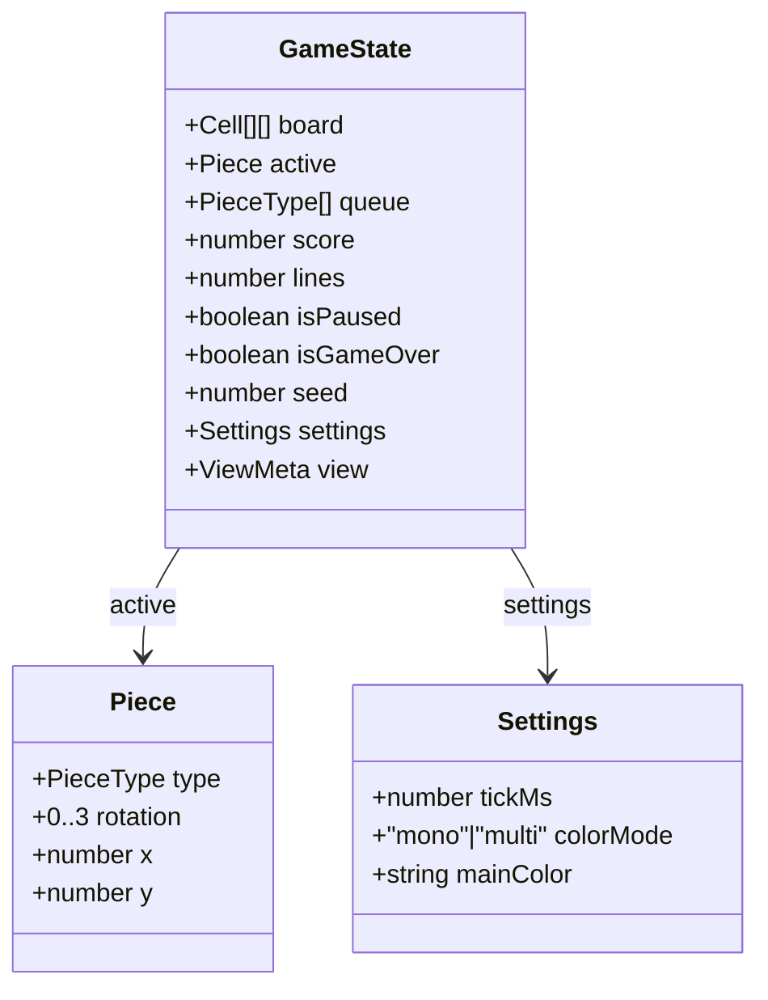

### Action Catalogue

| Action type | Payload | Description |
| --- | --- | --- |
| `TICK` | – | Advance piece one row; lock and spawn if grounded |
| `MOVE_LEFT` | – | Move active piece one column left |
| `MOVE_RIGHT` | – | Move active piece one column right |
| `MOVE_DOWN` | – | Move active piece one row down |
| `ROTATE_LEFT` | – | Rotate counter-clockwise with wall-kick |
| `ROTATE_RIGHT` | – | Rotate clockwise with wall-kick |
| `HARD_DROP` | – | Drop active piece to lowest valid position |
| `HOLD_PIECE` | – | Hold or swap active piece with reserve (gesture input only) |
| `TOGGLE_PAUSE` | – | Toggle `isPaused` (no-op when game over) |
| `UPDATE_SETTINGS` | `{ tickMs?, colorMode?, mainColor? }` | Merge new settings |
| `RESTART` | `{ seed? }` | Reset to fresh initial state |

### Gesture Recognition

The game uses `GestureRecognizer` for sophisticated multi-gesture touch input via PointerEvent API.
Key capabilities:

- **State machine approach** ensures unambiguous gesture classification with conflict resolution
- **8-gesture language**: tap, double-tap, 4-direction swipes, flick, multi-touch pause, hold
- **Velocity-based hard drop detection** (>200px/s) enables fast downward flicks
- **Cooldown management** prevents repeated action spam (80ms for moves, 60ms for soft drops)
- **Sensitivity presets** (casual/standard/competitive) for different play styles
- **Per-pointer tracking** enables reliable multi-touch operations (e.g., two-finger pause)
- **Pointer lifecycle management** prevents state leaks across gesture sequences

Integration: `createGestureRecognizer()` instantiated in `bindGameActions()` within `app.js` on `#board` element.

### Replay Snapshot Persistence

The main thread persists replay data in `localStorage` under key
`tetromino.replay.v1`.

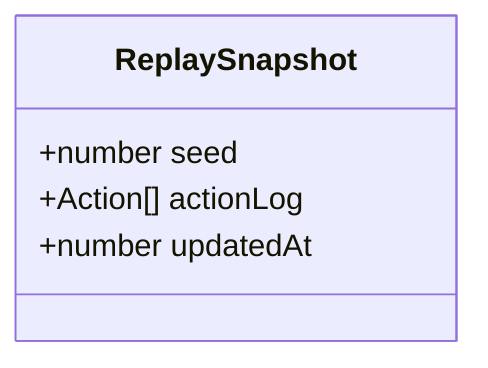

- `seed` is taken from the latest worker state.
- `actionLog` contains state-changing actions received from the worker.
- On `RESTART`, the log is reset so persistence represents the current run.
- The log is capped at 10,000 actions to keep storage bounded.

### Leaderboard Persistence

High scores are persisted in `localStorage` under key `tetromino.leaderboard.v1`.
Scores are bucketed by tick-delay ranges (100 ms buckets) so only comparable
game speeds compete with each other.

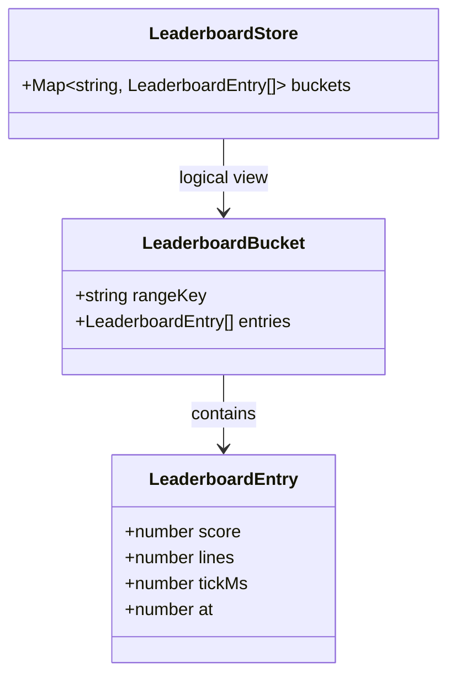

- Comparability is range-based: e.g. `300 ms` and `350 ms` are in `300-399 ms`.
- Each range keeps at most 10 entries, sorted by score then lines.
- Entries older than 30 days are pruned automatically.
- Manual reset clears all leaderboard data via the Reset scores button.

---

## 6.5 Offline Support and PWA

The app implements **offline-first caching** via a Service Worker, enabling players to continue
playing even when disconnected from the internet. Game progress and leaderboard data persist
across sessions via `localStorage`.

### Service Worker Architecture

**File:** `html5/src/service-worker.js` (~150 lines)

Implements dual caching strategies based on asset type:

| Asset Type | Strategy | Purpose | Cache |
| --- | --- | --- | --- |
| CSS, Images, Icons | Cache-first | Fast load, stale OK | `tetromino-static-v1` |
| HTML, JavaScript | Network-first | Latest code/UI, fallback cache | `tetromino-dynamic-v1` |
| Non-GET requests | Skipped | External calls, API requests | – |

**Cache-first flow:** Check cache → serve if hit → fetch from network in background → update cache on success

**Network-first flow:** Try network with 3s timeout → cache on success → fallback to cache on network failure → offline placeholder as last resort

### Registration and Lifecycle

**File:** `html5/src/js/app/service-worker-client.js`

Client-side registration module (`registerServiceWorker()`) handles:

- Browser support detection (graceful no-op if unsupported)
- Service worker installation at scope `/TetrominoStacking/html5/src/`
- Automatic cache cleanup on activation (removes old cache versions)
- Update detection and signaling via `sw-update-ready` custom event
- Online/offline status monitoring via `onOnlineStatusChange()` hook

### PWA Manifest

**File:** `html5/src/manifest.json`

Declares Progressive Web App metadata:

```json
{
  "name": "Tetromino Stacking",
  "start_url": "/TetrominoStacking/html5/src/index.html",
  "scope": "/TetrominoStacking/html5/src/",
  "display": "standalone",
  "orientation": "portrait-primary",
  "theme_color": "#1a1a1a",
  "categories": ["games"]
}
```

Enables:

- **Installation on home screen** (Android, iOS, desktop)
- **Standalone display** (full screen, hides browser chrome)
- **Custom theme color** (matches app color scheme)
- **App shortcuts** (quick "New Game" action)
- **Share target** (receives shared content via web intent)

### Offline Behavior

When network is unavailable:

1. **Static assets** served from cache (always available after first visit)
2. **HTML/JS** served from cache if available, else offline notice
3. **Game state** fully playable using cached assets
4. **Leaderboard** works with local `localStorage` (no network needed)
5. **Replay snapshots** persist and can be reviewed offline

**Fallback responses:**

- Missing HTML → Informative offline page with status and guidance
- Missing images → Placeholder SVG with warning icon
- Missing JS → 503 Service Unavailable (app requires JS)

### Browser Support

**Service Worker API support:**

- ✅ Chrome/Edge 40+
- ✅ Firefox 44+
- ✅ Safari 11.1+ (iOS 11.3+)
- ⚠️ IE 11: Graceful degradation (online-only)

**PWA Installation Requirements Met:**

✅ HTTPS required (or `localhost` for development)
✅ Valid manifest.json with required fields
✅ Service worker with install handler
✅ Icons in multiple sizes (32px, 64px, 128px)
✅ Maskable icons for adaptive display
✅ App name, description, theme color
✅ `display: "standalone"` for full-screen mode
✅ Scope and start_url aligned
✅ iOS web app meta tags enabled

### Installation Instructions by Platform

#### Android (Chrome, Firefox, Edge)

1. Visit the app (or bookmark it)
2. Look for install prompt (banner or menu option)
3. Tap "Install" or menu → "Install app"
4. Confirm: app appears on home screen

**If no prompt appears:**

- Manually: Long-press home → "Add to home screen" → select "Tetromino Stacking"

#### iOS (Safari 11.3+)

1. Visit the app in Safari
2. Tap **Share** (bottom toolbar)
3. Select **"Add to Home Screen"**
4. Name: defaults to "Tetromino Stacking" (can customize)
5. Tap **Add** → app appears on home screen

**Features on iOS:**

- Runs in standalone mode (full screen, hides browser chrome)
- Offline support via service worker
- Leaderboard and replay data persist
- Status bar respects `black-translucent` style

#### Desktop (Chrome, Edge)

1. Visit the app
2. Look for install icon (URL bar, top-right)
3. Click install icon or menu → "Install Tetromino Stacking"
4. Confirm: app launches in standalone window

**Features:**

- Installs as standalone application
- Shortcut on desktop/start menu
- Independent window (not in browser tab)
- All offline features available

#### Mac/Linux

Chrome, Edge, Chromium-based browsers support install via menu → "Install app" after meeting installability criteria.

### Implementation Notes

1. **Manifest requirements:** `manifest.json` must be valid JSON with required fields (`name`, `start_url`, `scope`, `display`, `icons`). Served with `Content-Type: application/manifest+json` header preferred (not required).

2. **Icon strategy:** Provide icons at multiple sizes (32x32 favicon, 64x64, 128x128) with both `purpose: "any"` and `purpose: "maskable"` entries. Maskable icons fill the safe zone on devices with non-rectangular displays.

3. **Cache version strategy:** Append `-v1` suffix to cache names. Increment version to bust all caches globally on service worker update.

4. **Network timeout:** 3s threshold prevents hanging on slow/unstable connections. Falls back to cache gracefully.

5. **No cache for user data:** Game state, replay snapshots, and leaderboards are never cached
   (stored in `localStorage` instead for guaranteed freshness).

6. **Update detection:** `sw-update-ready` event fires when new service worker installs.
   App can display "Update available" UI; users can reload to activate.

7. **Scope isolation:** Service worker scoped to `/TetrominoStacking/html5/src/` to avoid
   affecting other apps on the same domain.

---

## 7. State Chart

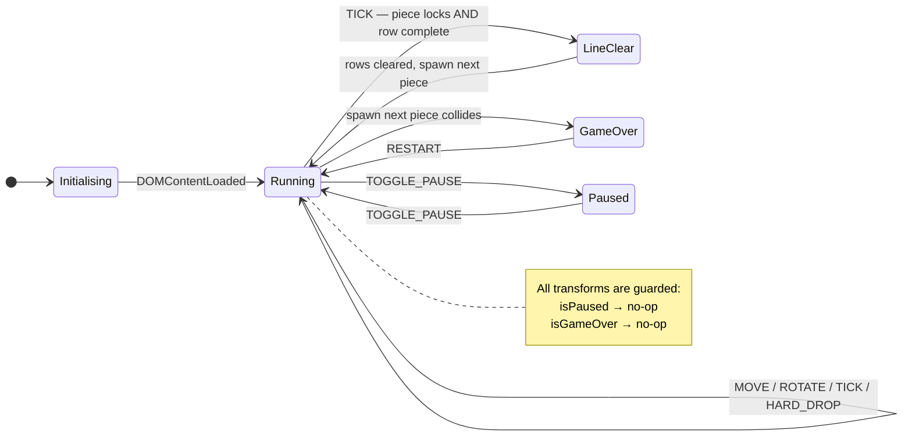

---

## 8. Runtime Workflow Diagram

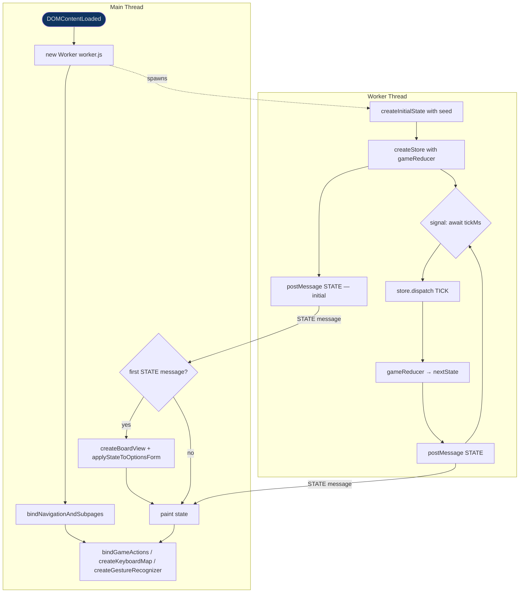

---

## 9. Object Message Exchange

### 9.1 Normal Tick (gravity)

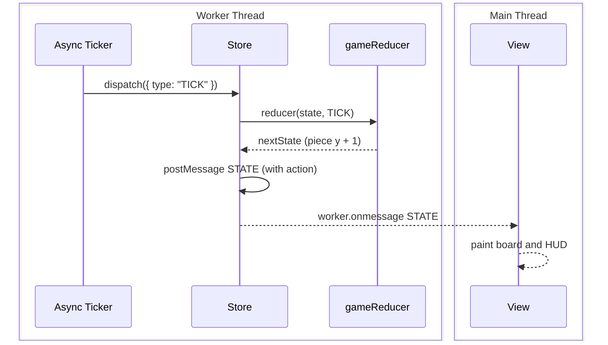

### 9.2 Piece lock and line clear

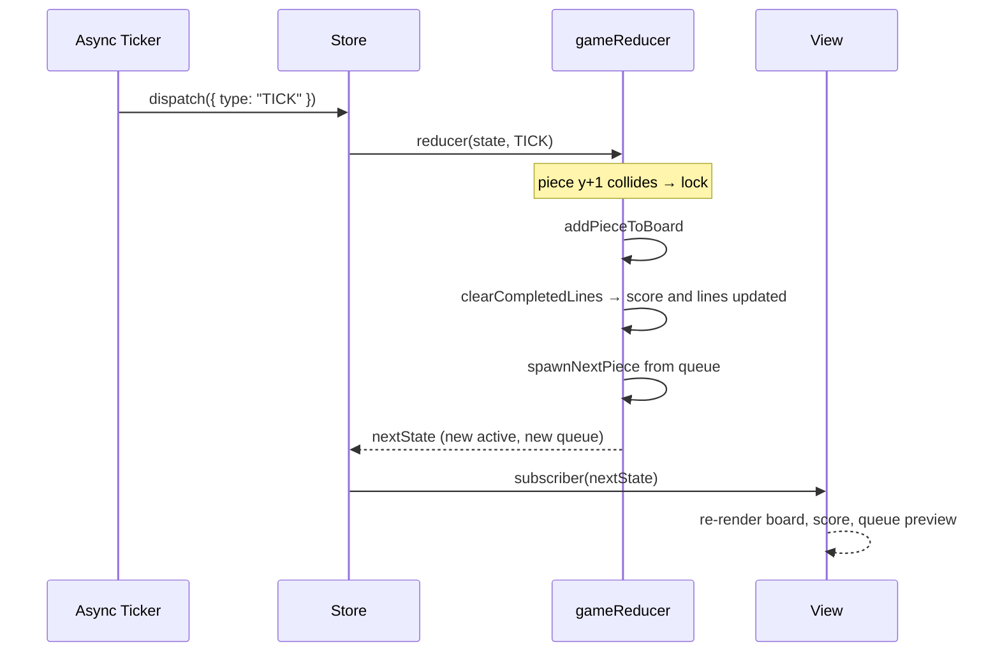

### 9.3 User keyboard input

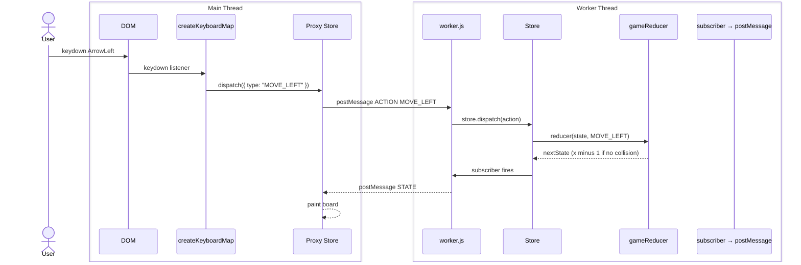

### 9.4 Options – OK flow

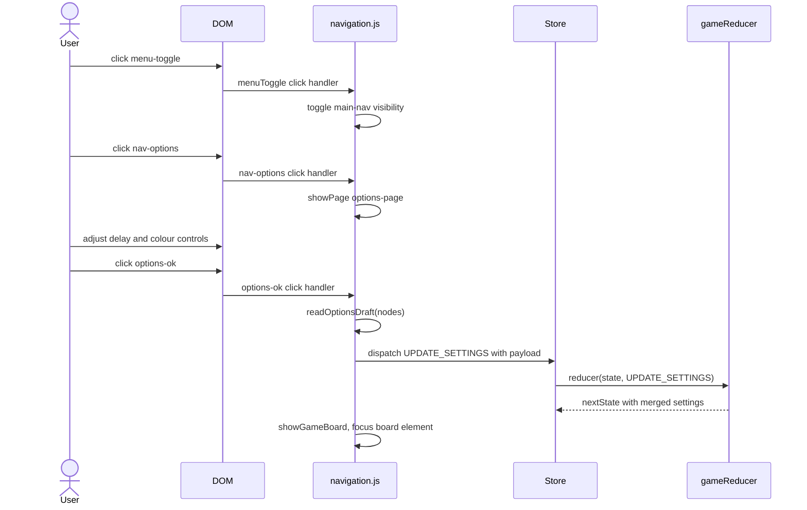

### 9.4b Touch swipe input

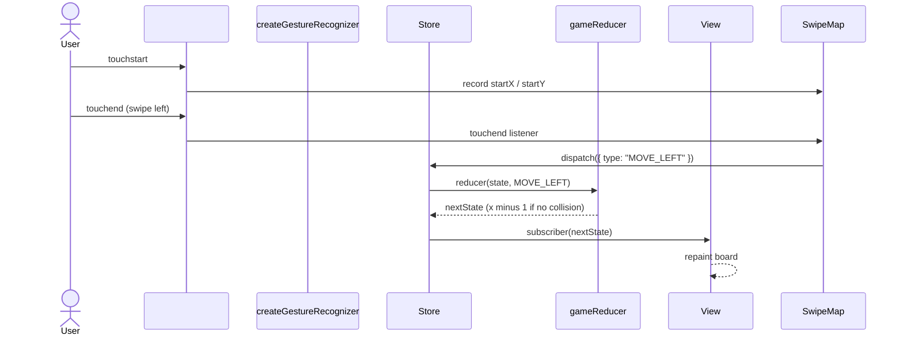

### 9.5 Game Over and Restart

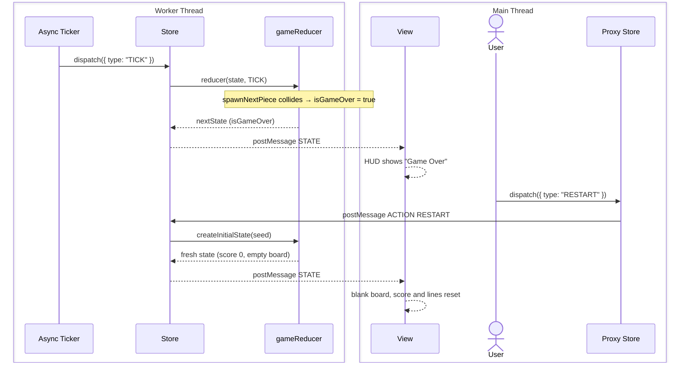

---

## 10. Navigation Flow Diagram

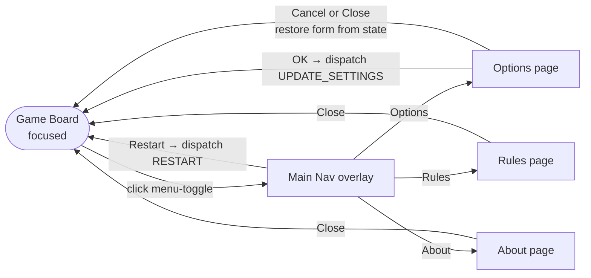

---

## 11. Test Architecture and Coverage Strategy

### 11.1 Tooling

| Tool | Role |
| --- | --- |
| **Vitest** | Test runner and assertion library |
| **jsdom** | DOM simulation for navigation and smoke tests |
| **@vitest/coverage-v8** | V8-native coverage instrumentation |

### 11.2 Test Files

| File | Environment | What is tested |
| --- | --- | --- |
| `tests/random.test.js` | node | LCG seed determinism, float/int distribution, list picking |
| `tests/tetrominoes.test.js` | node | Rotation normalisation, absolute cell projection |
| `tests/engine.test.js` | node | Board creation, collision detection, line clearing, all reducer actions, wall kick, projection |
| `tests/store.test.js` | node | Subscribe/dispatch/unsubscribe, no-notification on identity-equal state |
| `tests/gesture-recognizer.test.js` | node | Gesture state machine, tap/double-tap/swipe recognition, sensitivity presets, feedback callbacks, pointer cleanup |
| `tests/navigation.test.js` | jsdom | Menu toggle, page routing, options OK/Cancel, delay output sync, restart |
| `tests/index-smoke.test.js` | jsdom | Loads real `index.html` body; asserts expected DOM structure and full navigation flow |

### 11.3 Coverage Thresholds

Enforced in `vitest.config.js`:

```js
thresholds: {
  lines:      98,
  statements: 98,
  functions:  98,
  branches:   98,
}
```

Current achieved coverage: **100 % statements, 98.61 % branches, 100 % functions, 100 % lines** (170/170 statements, 71/72 branches, 45/45 functions, 153/153 lines).

### 11.4 Coverage Scope

Coverage is scoped to the pure-logic modules:

- `html5/src/js/core/**/*.js`
- `html5/src/js/app/store.js`
- `html5/src/js/app/gesture-recognizer.js`

DOM-coupled controller and navigation code is exercised via integration tests
(`navigation.test.js`, `index-smoke.test.js`) but excluded from the hard threshold gate
to keep the threshold meaningful rather than inflated by trivially-covered glue code.

---

## 12. File Structure

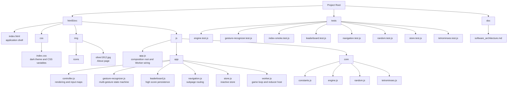

---

## 13. Migration Summary

The codebase was migrated from a monolithic jQuery/jQuery Mobile/Raphaël application to a
lean, framework-free ES-module architecture:

| Before | After |
| --- | --- |
| jQuery 2.2.4 + jQuery Mobile 1.4.5 | Zero runtime dependencies |
| Raphaël SVG canvas for board rendering | Native CSS Grid + DOM cells |
| Single `hmi.js` (501 lines, imperative, mutable state) | Layered modules, pure functions, reducer |
| No unit tests | 40 unit tests, 100 % coverage |
| `var`, prototype-based OOP | `const`/`let`, ES modules, higher-order functions |
| Blocking DOM polling (`$('#x').is(':checked')`) | Reactive store subscription |
| Hardcoded magic strings | Named constants in `constants.js` |
| `Math.random()` – non-deterministic | Seeded deterministic LCG |
| `./html5/src/thirdparty/` (3 libraries) | Removed entirely |

---

## 14. Future Extensions

| Idea | Benefit |
| --- | --- |
| AI autoplay strategy module | Training data via pure engine simulation |
