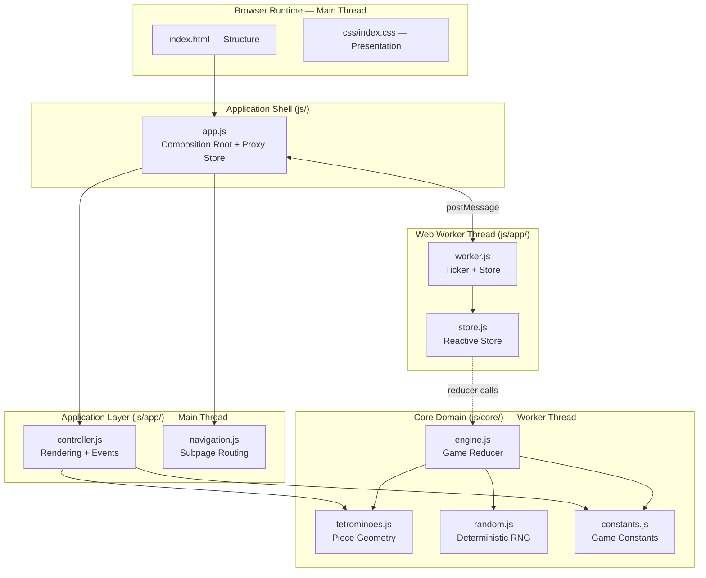
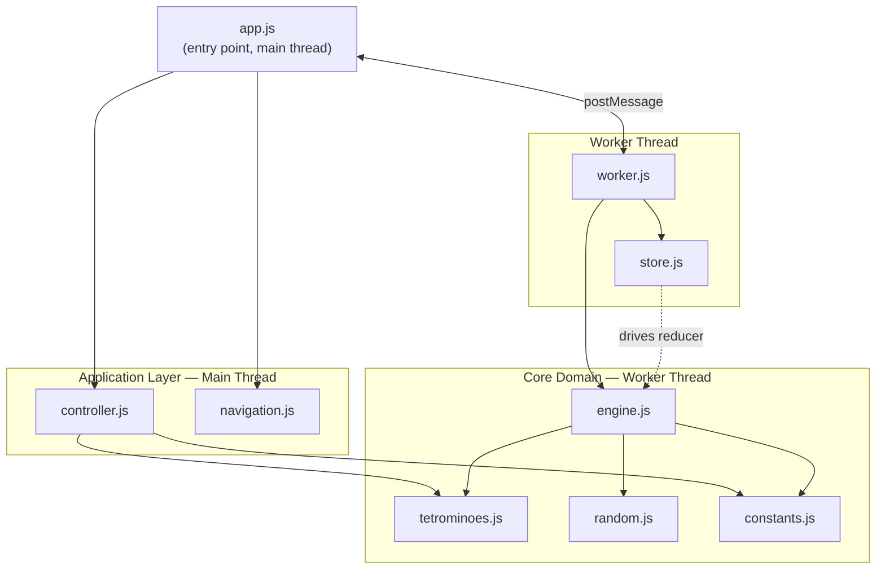
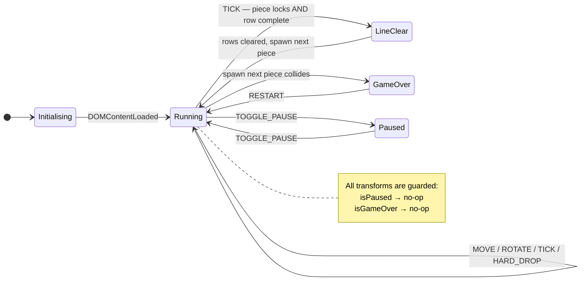
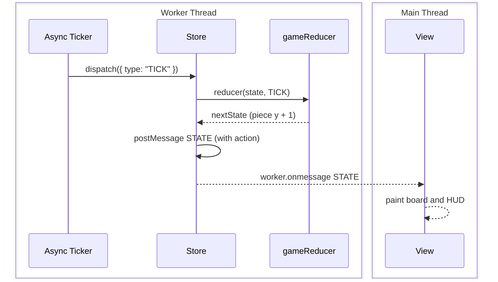
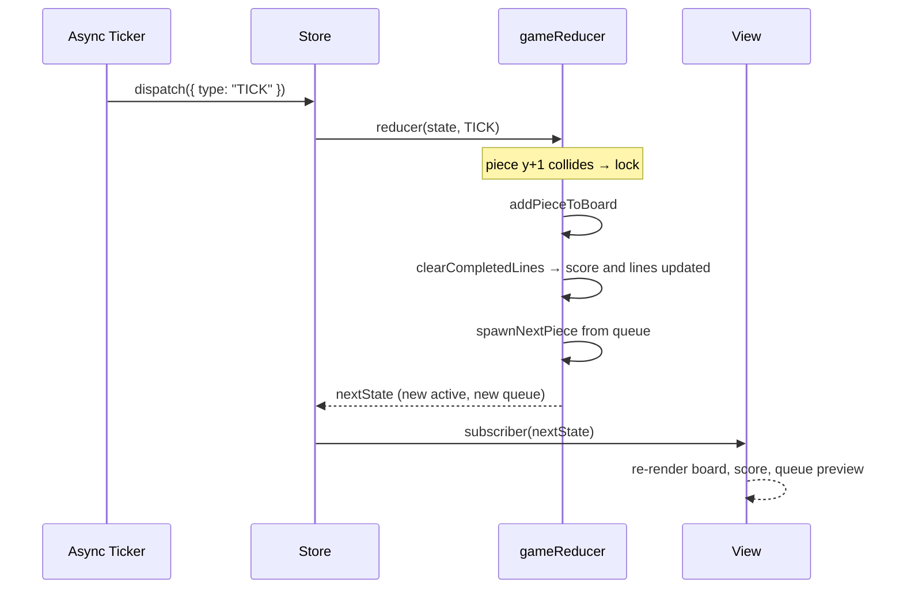
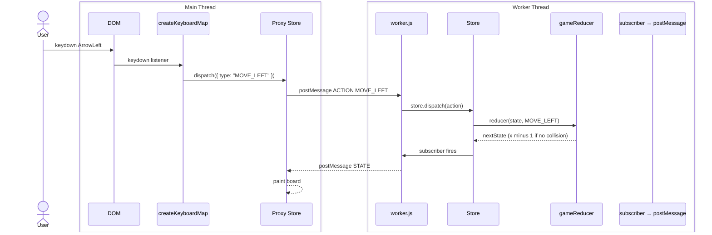
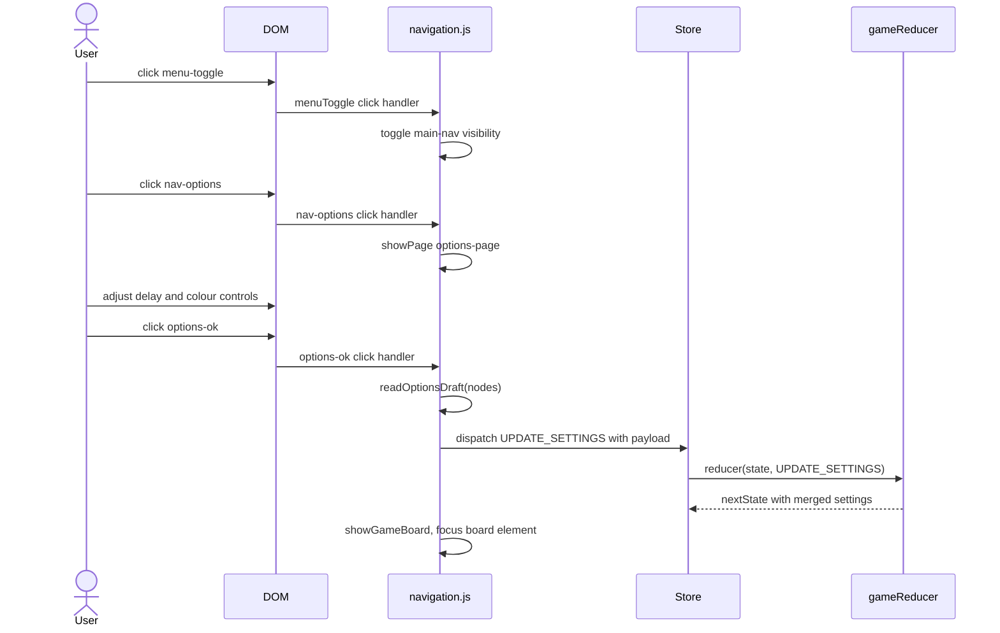
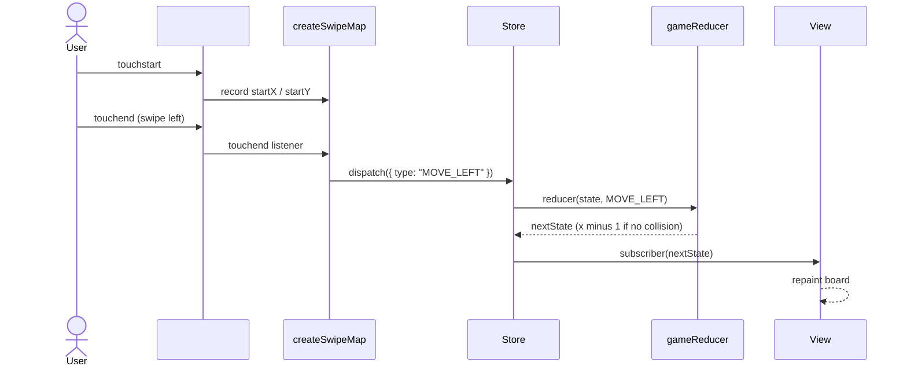
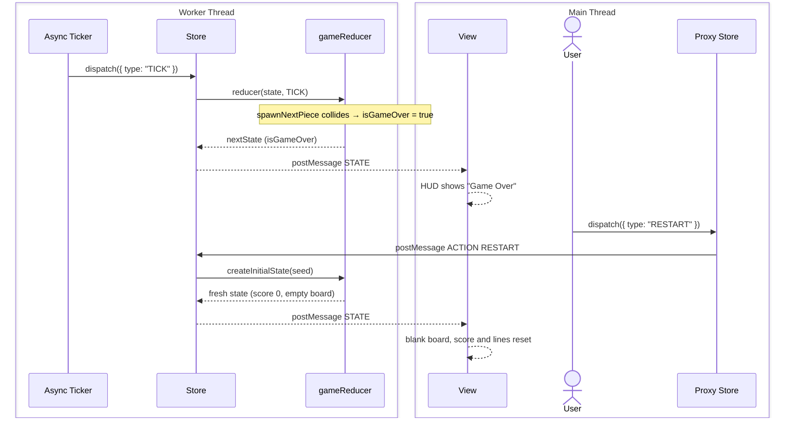

# Tetromino Stacking – Software Architecture

## Table of Contents

- [Tetromino Stacking – Software Architecture](#tetromino-stacking--software-architecture)
  - [Table of Contents](#table-of-contents)
  - [1. Purpose and Scope](#1-purpose-and-scope)
  - [2. Architectural Principles](#2-architectural-principles)
  - [3. Architecture Block Diagram](#3-architecture-block-diagram)
  - [4. Module Responsibilities](#4-module-responsibilities)
    - [4.1 Core Domain (`js/core/`)](#41-core-domain-jscore)
      - [`constants.js`](#constantsjs)
      - [`random.js`](#randomjs)
      - [`tetrominoes.js`](#tetrominoesjs)
      - [`engine.js`](#enginejs)
    - [4.2 Application Layer (`js/app/`)](#42-application-layer-jsapp)
      - [`store.js`](#storejs)
      - [`controller.js`](#controllerjs)
      - [`worker.js`](#workerjs)
      - [`navigation.js`](#navigationjs)
    - [4.3 Presentation (`html5/src/`)](#43-presentation-html5src)
      - [`index.html`](#indexhtml)
      - [`css/index.css`](#cssindexcss)
  - [5. Dependency Diagram](#5-dependency-diagram)
  - [6. State Model](#6-state-model)
    - [Action Catalogue](#action-catalogue)
    - [Swipe Gesture Map](#swipe-gesture-map)
    - [Replay Snapshot Persistence](#replay-snapshot-persistence)
    - [Leaderboard Persistence](#leaderboard-persistence)
  - [7. State Chart](#7-state-chart)
  - [8. Runtime Workflow Diagram](#8-runtime-workflow-diagram)
  - [9. Object Message Exchange](#9-object-message-exchange)
    - [9.1 Normal Tick (gravity)](#91-normal-tick-gravity)
    - [9.2 Piece lock and line clear](#92-piece-lock-and-line-clear)
    - [9.3 User keyboard input](#93-user-keyboard-input)
    - [9.4 Options – OK flow](#94-options--ok-flow)
    - [9.4b Touch swipe input](#94b-touch-swipe-input)
    - [9.5 Game Over and Restart](#95-game-over-and-restart)
  - [10. Navigation Flow Diagram](#10-navigation-flow-diagram)
  - [11. Test Architecture and Coverage Strategy](#11-test-architecture-and-coverage-strategy)
    - [11.1 Tooling](#111-tooling)
    - [11.2 Test Files](#112-test-files)
    - [11.3 Coverage Thresholds](#113-coverage-thresholds)
    - [11.4 Coverage Scope](#114-coverage-scope)
  - [12. File Structure](#12-file-structure)
  - [13. Migration Summary](#13-migration-summary)
  - [14. Future Extensions](#14-future-extensions)

---

## 1. Purpose and Scope

This document describes the software architecture of **Tetromino Stacking**, a browser-based
solitaire tile-stacking game. The architecture was designed around the following goals:

- **Zero runtime dependencies** – no jQuery, jQuery Mobile, Raphaël, or any UI framework.
- **Pure functional game core** – all game logic is expressed as pure functions and a
  deterministic reducer, making it trivially testable and reproducible.
- **Reactive rendering** – the UI is a projection of state; changes propagate through a
  lightweight reactive store.
- **Async game loop** – the ticker is an `async/await` loop driven by `AbortController`,
  making it easy to pause, resume, and cancel cleanly.
- **High-confidence testing** – 100 % statement, line, function and branch coverage enforced
  by a coverage gate in CI configuration.

---

## 2. Architectural Principles

| Principle | Description |
| --- | --- |
| **Functional Core, Imperative Shell** | All domain logic (collision, line clearing, scoring, queue) lives in stateless pure functions. Side effects (DOM, timers, events) are isolated in the app shell. |
| **Immutable State** | Every action produces a new state object; original state is never mutated. |
| **Deterministic Randomness** | The pseudo-random generator is seeded and returns both the value and the next seed, enabling replay of any game by replaying the seed. |
| **Single Responsibility** | Each module has one clear purpose. The store does not know about rendering; the engine does not know about DOM. |
| **Dependency Direction** | Dependencies flow inward: `app.js` → `app/*` → `core/*`. Nothing in `core/` depends on the browser. |

---

## 3. Architecture Block Diagram



---

## 4. Module Responsibilities

### 4.1 Core Domain (`js/core/`)

#### `constants.js`

Exports pure compile-time constants shared across all layers:

- Board dimensions (`BOARD_COLS`, `BOARD_ROWS`, `BOARD_VISIBLE_ROWS`, `BOARD_HIDDEN_ROWS`)
- Tick interval (`INITIAL_TICK_MS`)
- Piece type identifiers (`PIECE_TYPES`)
- Per-piece colours (`PIECE_COLORS`)
- Empty cell sentinel (`CELL_EMPTY = null`)

#### `random.js`

Implements a 32-bit LCG (linear congruential generator):

```text
seed' = (1664525 × seed + 1013904223) mod 2³²
```

All functions return `{ seed, value }` – the caller threads the seed explicitly,
making every call reproducible.

| Export | Description |
| --- | --- |
| `nextSeed(seed)` | Advance the seed one step |
| `nextFloat(seed)` | Uniform float in `[0, 1)` |
| `nextInt(seed, max)` | Integer in `[0, max)` |
| `pickFromList(seed, list)` | Pick a uniformly random element |

#### `tetrominoes.js`

Defines all seven tetrominoes and four rotations each using relative cell
offsets. The `cellsForPiece(piece)` function converts a piece descriptor
`{ type, rotation, x, y }` into absolute board coordinates.

#### `engine.js`

The heart of the application. All exports are pure functions:

| Export | Description |
| --- | --- |
| `createBoard()` | Produce an empty board matrix |
| `collides(board, piece)` | Detect collisions (wall, floor, occupied cell) |
| `clearCompletedLines(board)` | Remove full rows, return new board + count |
| `createInitialState(seed)` | Build a full initial game state |
| `gameReducer(state, action)` | Transition function – returns next state |
| `projectBoardWithActivePiece(state)` | Overlay active piece on board for rendering |

### 4.2 Application Layer (`js/app/`)

#### `store.js`

Minimal reactive store:

```text
createStore(reducer, initialState) → { getState, dispatch, subscribe }
```

- `dispatch(action)` – runs the reducer; notifies subscribers only when state reference changes.
- `subscribe(listener)` – returns an unsubscribe function (no memory leak).

#### `controller.js`

DOM rendering helpers and event wiring:

| Export | Description |
| --- | --- |
| `createBoardView(node, rows, cols)` | Build and return a `paint(state, board)` renderer |
| `renderQueue(queueNode, state)` | Paint the piece-preview queue |
| `renderHUD(scoreNode, pauseBtn, state)` | Update score/status text |
| `createActionBinding(el, ev, factory, dispatch)` | Attach and return a removable event listener |
| `createKeyboardMap(dispatch)` | Map keyboard codes to game actions |
| `createSwipeMap(element, dispatch)` | Map touch swipe/tap gestures on an element to game actions |

#### `worker.js`

Web Worker entry point. Runs entirely off the main thread:

- Creates the store and initial state (seeded with `Date.now()`).
- Runs the async gravity ticker loop (`TICK` every `tickMs` milliseconds).
- Posts `{ type: "STATE", state, action }` to the main thread on every state change and `{ type: "STATE", state }` once on startup.
- Handles incoming `{ type: "ACTION", action }` messages from the main thread by calling `store.dispatch`.

#### `navigation.js`

Subpage routing without a router library:

| Export | Description |
| --- | --- |
| `bindNavigationAndSubpages(nodes, store)` | Wire all menu, subpage open/close, and options OK/Cancel flows |
| `readOptionsDraft(nodes)` | Read current form values into a settings object |
| `applyStateToOptionsForm(nodes, state)` | Sync form controls to state |

### 4.3 Presentation (`html5/src/`)

#### `index.html`

Semantic, ARIA-annotated markup organised into:

- `<header>` – menu toggle, title, HUD score label
- `<main>` – board grid, piece queue, touch control pad, keyboard hints
- `<nav id="main-nav">` – slide-over navigation menu
- `<section id="options-page">` – Options modal (delay, colour mode, main colour)
- `<section id="rules-page">` – Rules modal
- `<section id="about-page">` – About / legal modal

#### `css/index.css`

Custom-property-driven dark theme. No CSS framework dependency.

Key design tokens:

| Token | Role |
| --- | --- |
| `--bg` | Page background |
| `--surface` | Card / panel background |
| `--board-bg` / `--cell-empty` | Board interior colours |
| `--accent` | Interactive highlight colour |
| `--cell-size` | Responsive board cell dimension |

---

## 5. Dependency Diagram



---

## 6. State Model

The complete game state is a plain JavaScript object:

```text
GameState {
  board       : Cell[][]      // BOARD_ROWS × BOARD_COLS; Cell = PieceType | null
  active      : Piece         // currently falling piece
  queue       : PieceType[]   // look-ahead queue (INITIAL_QUEUE_SIZE items)
  score       : number
  lines       : number
  isPaused    : boolean
  isGameOver  : boolean
  seed        : number        // LCG seed for the next random draw
  settings    : Settings      // tickMs, colorMode, mainColor
  view        : ViewMeta      // rows, cols, hiddenRows (for rendering offset)
}

Piece {
  type        : "I"|"O"|"T"|"S"|"Z"|"J"|"L"
  rotation    : 0 | 1 | 2 | 3
  x           : number        // column of piece origin
  y           : number        // row of piece origin
}

Settings {
  tickMs      : number
  colorMode   : "mono" | "multi"
  mainColor   : string        // CSS colour string
}
```

### Action Catalogue

| Action type | Payload | Description |
| --- | --- | --- |
| `TICK` | – | Advance piece one row; lock and spawn if grounded |
| `MOVE_LEFT` | – | Move active piece one column left |
| `MOVE_RIGHT` | – | Move active piece one column right |
| `MOVE_DOWN` | – | Move active piece one row down |
| `ROTATE_LEFT` | – | Rotate counter-clockwise with wall-kick |
| `ROTATE_RIGHT` | – | Rotate clockwise with wall-kick |
| `HARD_DROP` | – | Drop active piece to lowest valid position |
| `TOGGLE_PAUSE` | – | Toggle `isPaused` (no-op when game over) |
| `UPDATE_SETTINGS` | `{ tickMs?, colorMode?, mainColor? }` | Merge new settings |
| `RESTART` | `{ seed? }` | Reset to fresh initial state |

### Swipe Gesture Map

`createSwipeMap(element, dispatch)` listens for `touchstart`/`touchend` on the board element.
A minimum of 30 px travel distinguishes a swipe from a tap.

| Gesture | Action |
| --- | --- |
| Swipe left | `MOVE_LEFT` |
| Swipe right | `MOVE_RIGHT` |
| Swipe down | `TICK` (soft drop) |
| Swipe up | `HARD_DROP` |
| Tap (< 30 px) | `ROTATE_RIGHT` |

### Replay Snapshot Persistence

The main thread persists replay data in `localStorage` under key
`tetromino.replay.v1`.

```text
ReplaySnapshot {
  seed      : number
  actionLog : Action[]
  updatedAt : number   // epoch milliseconds
}
```

- `seed` is taken from the latest worker state.
- `actionLog` contains state-changing actions received from the worker.
- On `RESTART`, the log is reset so persistence represents the current run.
- The log is capped at 10,000 actions to keep storage bounded.

### Leaderboard Persistence

High scores are persisted in `localStorage` under key `tetromino.leaderboard.v1`.
Scores are bucketed by tick-delay ranges (100 ms buckets) so only comparable
game speeds compete with each other.

```text
LeaderboardStore {
  buckets: {
    "300-399": [
      { score, lines, tickMs, at },
      ...
    ],
    ...
  }
}
```

- Comparability is range-based: e.g. `300 ms` and `350 ms` are in `300-399 ms`.
- Each range keeps at most 10 entries, sorted by score then lines.
- Entries older than 30 days are pruned automatically.
- Manual reset clears all leaderboard data via the Reset scores button.

---

## 7. State Chart



---

## 8. Runtime Workflow Diagram


---

## 9. Object Message Exchange

### 9.1 Normal Tick (gravity)



### 9.2 Piece lock and line clear



### 9.3 User keyboard input



### 9.4 Options – OK flow



### 9.4b Touch swipe input



### 9.5 Game Over and Restart



---

## 10. Navigation Flow Diagram


---

## 11. Test Architecture and Coverage Strategy

### 11.1 Tooling

| Tool | Role |
| --- | --- |
| **Vitest** | Test runner and assertion library |
| **jsdom** | DOM simulation for navigation and smoke tests |
| **@vitest/coverage-v8** | V8-native coverage instrumentation |

### 11.2 Test Files

| File | Environment | What is tested |
| --- | --- | --- |
| `tests/random.test.js` | node | LCG seed determinism, float/int distribution, list picking |
| `tests/tetrominoes.test.js` | node | Rotation normalisation, absolute cell projection |
| `tests/engine.test.js` | node | Board creation, collision detection, line clearing, all reducer actions, wall kick, projection |
| `tests/store.test.js` | node | Subscribe/dispatch/unsubscribe, no-notification on identity-equal state |
| `tests/navigation.test.js` | jsdom | Menu toggle, page routing, options OK/Cancel, delay output sync, restart |
| `tests/index-smoke.test.js` | jsdom | Loads real `index.html` body; asserts expected DOM structure and full navigation flow |

### 11.3 Coverage Thresholds

Enforced in `vitest.config.js`:

```js
thresholds: {
  lines:      98,
  statements: 98,
  functions:  98,
  branches:   98,
}
```

Current achieved coverage: **100 % statements, 100 % branches, 100 % functions, 100 % lines**.

### 11.4 Coverage Scope

Coverage is scoped to the pure-logic modules:

- `html5/src/js/core/**/*.js`
- `html5/src/js/app/store.js`

DOM-coupled controller and navigation code is exercised via integration tests
(`navigation.test.js`, `index-smoke.test.js`) but excluded from the hard threshold gate
to keep the threshold meaningful rather than inflated by trivially-covered glue code.

---

## 12. File Structure

```text
html5/src/
├── index.html              – application shell (no framework dependencies)
├── css/
│   └── index.css           – standalone dark theme, CSS custom properties
├── img/
│   ├── icons/              – app icons (various resolutions)
│   └── oliver1912.jpg      – author photo (About page)
└── js/
    ├── app.js              – composition root; proxy store; Worker wiring
    ├── app/
    │   ├── controller.js   – rendering helpers, keyboard map, swipe map
    │   ├── leaderboard.js  – localStorage high score buckets and pruning
    │   ├── navigation.js   – subpage routing, options form binding
    │   ├── store.js        – reactive store (used inside the Worker)
    │   └── worker.js       – Web Worker: game state, ticker, engine
    └── core/
        ├── constants.js    – game constants
        ├── engine.js       – pure game reducer and helpers
        ├── random.js       – deterministic LCG
        └── tetrominoes.js  – piece rotation data and cell projection

tests/
├── engine.test.js
├── index-smoke.test.js
├── leaderboard.test.js
├── navigation.test.js
├── random.test.js
├── store.test.js
└── tetrominoes.test.js

doc/
└── software_architecture.md  – this document
```

---

## 13. Migration Summary

The codebase was migrated from a monolithic jQuery/jQuery Mobile/Raphaël application to a
lean, framework-free ES-module architecture:

| Before | After |
| --- | --- |
| jQuery 2.2.4 + jQuery Mobile 1.4.5 | Zero runtime dependencies |
| Raphaël SVG canvas for board rendering | Native CSS Grid + DOM cells |
| Single `hmi.js` (501 lines, imperative, mutable state) | Layered modules, pure functions, reducer |
| No unit tests | 40 unit tests, 100 % coverage |
| `var`, prototype-based OOP | `const`/`let`, ES modules, higher-order functions |
| Blocking DOM polling (`$('#x').is(':checked')`) | Reactive store subscription |
| Hardcoded magic strings | Named constants in `constants.js` |
| `Math.random()` – non-deterministic | Seeded deterministic LCG |
| `./html5/src/thirdparty/` (3 libraries) | Removed entirely |

---

## 14. Future Extensions

| Idea | Benefit |
| --- | --- |
| AI autoplay strategy module | Training data via pure engine simulation |
